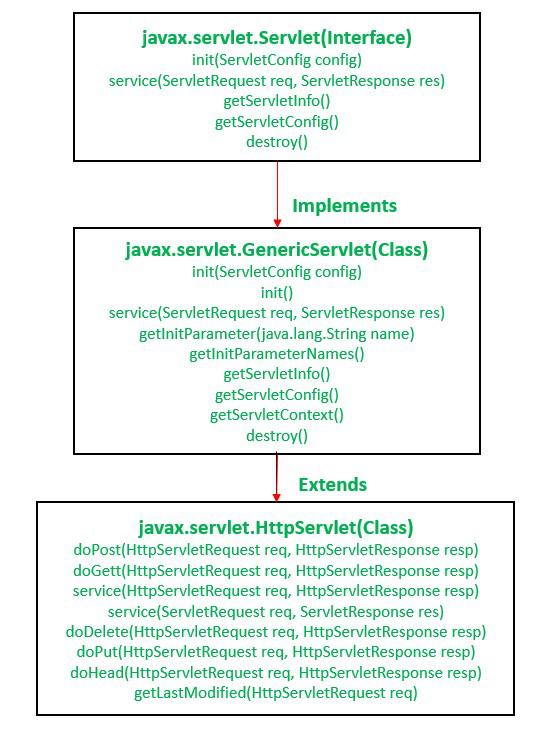
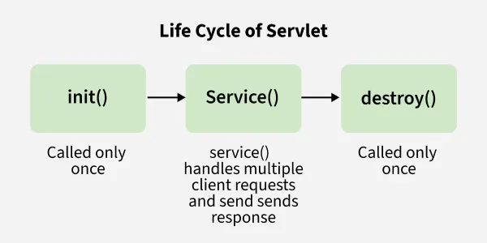

## Servlet
Java Servlets are Java programs that run on a web server and are used to build web applications. Servlets provide a way to generate dynamic content on the web.

Servlets are typically used in conjunction with a web server such as Apache Tomcat and can be used to handle HTTP requests, generating HTML or XML content and interacting with databases and other backend systems.

### Servlet API
The Servlet API is a set of classes and interfaces, which are available with two important packages:
- `jakarta.servlet.*` - provides interfaces and classes to support generic servet which is  protocol independent.
- `jakarta.servlet.http.*` - provides interfaces and classes to support HTTP servlet which is HTTP protocol dependent.

The main interfaces and classes in the Servlet API are:
- `jakarta.servlet.Servlet`: The main interface that all servlets must implement. It defines the `init`, `service`and `destory` methods that make up the servlet life cycle.
- `jakarta.servlet.ServletRequest`: defines an object to provide client request information to a servlet. The servlet container creates a `ServletRequest` object and passes it as an argument to the servlet's `service` method. A `ServletRequest` object provides data including parameter name and values, attributes, and an input stream. Interfaces that extend `ServletRequest` can provide additional protocol-specific data (for example, HTTP data is provided by `HttpServletRequest`).
- `jakarta.servlet.ServletResponse`: defines an object to assist a servlet in sending a response to the client. The servlet container creates a `ServletResponse` object and passes it as an argument to the servlet's `service` method. To send binary data in a MIME body response, use the `ServletOutputStream` object returned by `getOutputStream()`. To send character data, use the `PrintWriter` object returned by `getWriter()`. To mix binary and text data, for example, to create a multipart response, use a `ServletOutputStream` and manage the character sections manually. The charset for the MIME body response can be explicitly specified using any of the following techniques:
  - per web application by using `ServletContext.setRequestCharacterEnoding(java.lang.String)`, deployment descriptor)
  - per container by using vendor specific configuration for all web applications deployed in that container.
  - per request by using `setCharacterEncoding(String)`, `setharacterEncoding(Charset)` and `setContentType(java.lang.String)` or implicitly by using `setLocale(java.util.Locale)`.
- `jakarta.servlet.ServletConfig`
- `jakrata.servlet.ServletContext`

### Servlet Hierarchy

### Servlet Life Cycle
There are three life cycle methods of a servlet:
- `init()`- invoked once when the `Servlet` is instantiated.
- `service()` 
  - handles client requests and responses
  - determines HTTP request (implemented in `HttpServlet`)
- `destroy()`
- 
