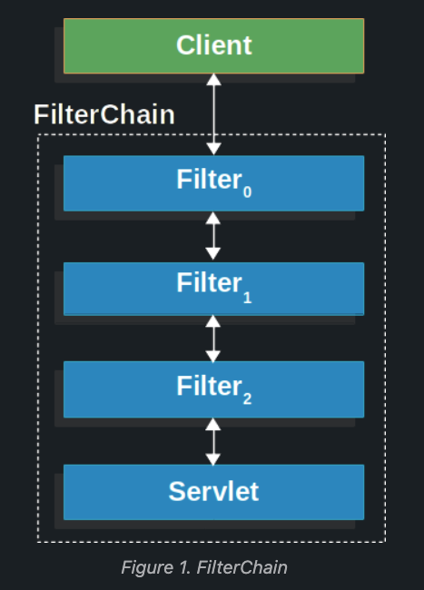

## Architecture
Spring security's servlet support is based on Servlet Filters (Java Servlet API). The Client sends a request to the application, and the servlet container creates a `Filter Chain`, which contains the `Filter` instances and `Servlet` that should process the `HttpServletRequest`, based on the path of the request URI. In a Spring MVC application, the `Servlet` is an instance of `DispachterServlet`. 
