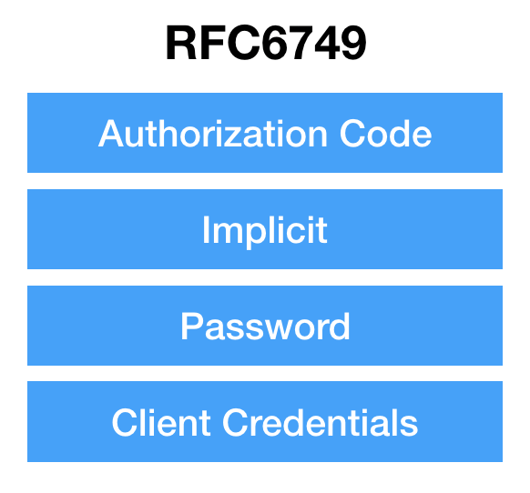
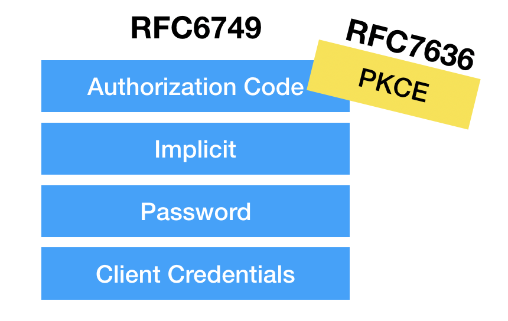
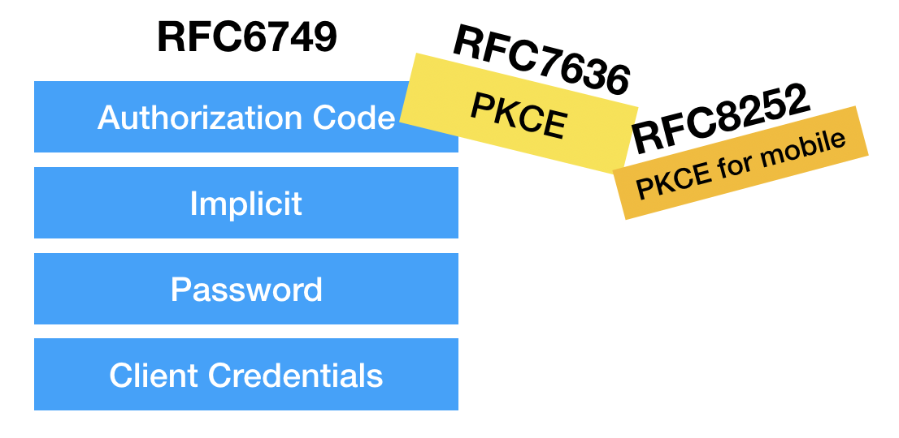
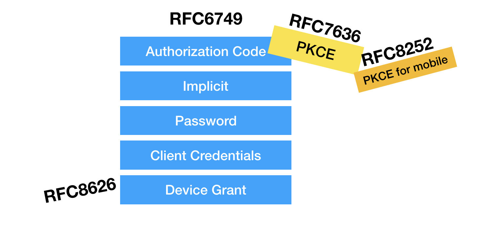
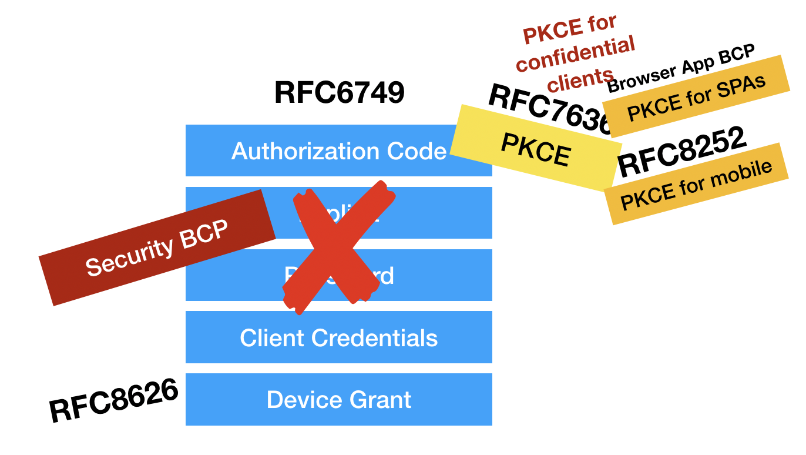
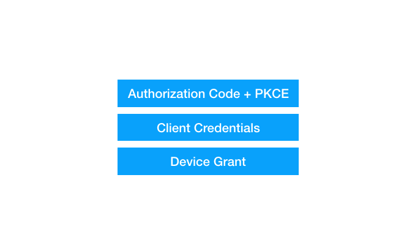

## OAuth
A summary of the article [its time for oauth 2.1](https://aaronparecki.com/2019/12/12/21/its-time-for-oauth-2-dot-1).

OAuth is actually made of many different RFCs (Request For Comments), building upon each other and adding
features in different ways. 

The "core" OAuth spec, RFC 6749, even isn't called a specification, it's technically 
a "framework" you can use to build specifications from. Part of the reason for this is 
that it leaves a lot of things optional, and requires that an implementer makes decisions 
about things like which grant types to support, whether refresh tokens are one-time use, 
and even whether access tokens should be Bearer tokens or use some sort of signed token 
mechanism.

### OAuth 2.0 Landscape
#### The OAuth core spec (RFC 6749) defines four grant types:

#### PKCE - Proof Key for Code Exchange (RFC 7636) 
PKCE (pronounced pixie) is created to provide a way to use Authorization Code flow 
without a client secret.

#### OAuth 2.0 for Native Apps (RFC 8252)
A native app refers to a client application that is installed and executed directly on
the user's device. These apps are typically built for a specific platform or operating
system, such as:
- Mobile platforms: iOS or Android
- Desktop operating system: Windows, macOS, Linux
Native apps are distinct from web apps because they run outside a browser and often use
platform-specific APIs.

#### Device Grant (RFC 8626)
A new OAuth grant `Device Grant` was created to let a new class of devices to use OAuth,
- Embedded devices: Smart TVs, game consoles, etc.

### Best Practices
According [best practices for single-page apps](https://oauth.net/2/browser-based-apps/) 
and the latest [Security Best Current Practice](https://oauth.net/2/oauth-best-practice/),
the single-page apps is recommended to use PKCE. The Implicit flow and Password grant are
deprecated.

Due to the modifications, OAuth looks current like this,

Which actually ends up to this:

#### OAuth 2.1
The main goal with [OAuth 2.1](https://oauth.net/2.1/) is to capture the best practice in
OAuth 2.0 and its extensions under a single name. OAuth 2.1 will not define any new
behaviour, it also won't include anything considered experimental or still in progress.

With OAuth 2.1, the Security Best Current Practice (BCP) is irrelevant, because OAuth 2.1
only provide the secure option.

